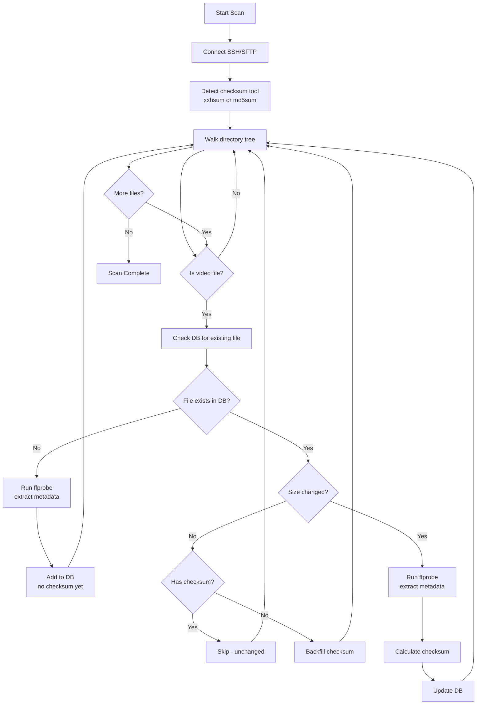
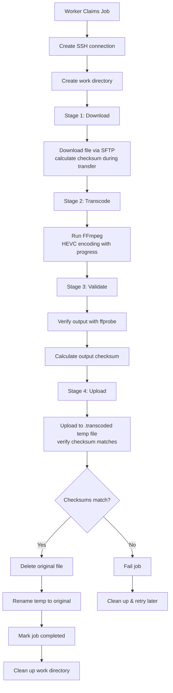

# Transcoder Architecture

## Overview

A TUI-based media transcoder that scans remote libraries via SSH/SFTP, queues files for transcoding, and manages the entire workflow with integrity verification.

## Components

```
┌─────────────────────────────────────────────────────────┐
│                    TUI (Bubble Tea)                     │
│  Dashboard │ Jobs │ Files │ Settings │ Logs            │
└─────────────────────┬───────────────────────────────────┘
                      │
┌─────────────────────┼───────────────────────────────────┐
│                     │                                   │
│  ┌─────────┐   ┌────▼────┐   ┌──────────┐              │
│  │ Scanner │   │ Worker  │   │ Encoder  │              │
│  │         │   │  Pool   │   │ (FFmpeg) │              │
│  └────┬────┘   └────┬────┘   └────┬─────┘              │
│       │             │              │                    │
│       └─────────────┼──────────────┘                    │
│                     │                                   │
│              ┌──────▼──────┐                            │
│              │   Database  │                            │
│              │  (SQLite)   │                            │
│              └─────────────┘                            │
└─────────────────────────────────────────────────────────┘
```

## Package Structure

```
transcoder-go/
├── cmd/transcoder/       # Main entry point
├── internal/
│   ├── config/           # YAML configuration
│   ├── database/         # SQLite schema & queries
│   ├── scanner/          # Remote library scanning (SSH/SFTP)
│   ├── transcode/        # Worker pool & FFmpeg encoding
│   ├── checksum/         # xxHash64/MD5 utilities
│   ├── tui/              # Bubble Tea TUI
│   └── types/            # Shared data types
└── docs/                 # Documentation
```

---

## Scanning Flow



---

## Transcoding Flow



---

## Database Schema

### media_files
Discovered video files from remote library.

| Column | Type | Description |
|--------|------|-------------|
| id | INTEGER | Primary key |
| file_path | TEXT | Full remote path |
| file_name | TEXT | Filename only |
| file_size_bytes | INTEGER | File size |
| codec | TEXT | Video codec (h264, hevc, etc.) |
| resolution_width | INTEGER | Width in pixels |
| resolution_height | INTEGER | Height in pixels |
| duration_seconds | REAL | Video duration |
| bitrate_kbps | INTEGER | Bitrate |
| fps | REAL | Frames per second |
| should_transcode | BOOLEAN | Needs transcoding? |
| transcoding_priority | INTEGER | Queue priority |
| source_checksum | TEXT | xxHash64 or MD5 |
| source_checksum_algo | TEXT | Algorithm used |
| source_checksum_at | TIMESTAMP | When calculated |

### transcode_jobs
Active and completed transcoding jobs.

| Column | Type | Description |
|--------|------|-------------|
| id | INTEGER | Primary key |
| media_file_id | INTEGER | FK to media_files |
| status | TEXT | queued/downloading/transcoding/uploading/completed/failed/paused/canceled |
| stage | TEXT | download/transcode/validate/upload |
| progress | REAL | 0-100 percentage |
| worker_id | TEXT | Assigned worker |
| transcoded_file_size_bytes | INTEGER | Output size |
| encoding_time_seconds | INTEGER | Total encode time |
| encoding_fps | REAL | Encoding speed |
| local_input_checksum | TEXT | Downloaded file checksum |
| local_output_checksum | TEXT | Transcoded file checksum |
| uploaded_checksum | TEXT | Uploaded file checksum |
| checksum_verified | BOOLEAN | All checksums match |
| error_message | TEXT | Last error |
| retry_count | INTEGER | Number of retries |
| priority | INTEGER | Job priority |

### processing_log
Event log for debugging.

### system_state
Key-value store for app state (last scan time, schema version, etc.)

---

## Configuration

```yaml
remote:
  host: "media-server"
  port: 22
  user: "user"
  library_path: "/path/to/media"

local:
  database_path: "~/.transcoder/transcoder.db"

workers:
  max_workers: 2
  work_dir: "~/.transcoder/work"

encoding:
  codec: "libx265"
  preset: "medium"
  crf: 23
  # Additional FFmpeg options...
```

---

## Key Design Decisions

### Checksum Strategy
- **First scan**: Skip checksums for speed (ffprobe only)
- **Subsequent scans**: Backfill checksums for unchanged files
- **Size comparison**: Fast change detection without reading entire file
- **Transfer verification**: Checksums calculated during download/upload

### Job Recovery
- Jobs survive application restart
- Orphaned jobs (downloading/transcoding/uploading) are recovered
- Workers re-claim orphaned jobs with priority

### Atomic File Replacement
1. Upload to `filename.transcoded` (temp)
2. Verify upload checksum matches local output
3. Delete original
4. Rename temp to original

### Worker Pool
- Configurable number of concurrent workers
- Each worker has dedicated SSH connection
- Progress updates via channel to TUI
- Pause/cancel support per job
- **Graceful scaling**: Workers complete current job before stopping when scaled down

### Progress Tracking
- **Download/Upload**: Byte-based progress (bytes transferred / total bytes)
- **Transcoding**: Time-based progress using `out_time_us` from ffmpeg (more reliable than frame count)

---

## Performance Optimizations

1. **Skip ffprobe for unchanged files** - DB lookup before expensive remote call
2. **Lazy checksum backfill** - First scan is fast, checksums fill in later
3. **Size-based change detection** - No need to read file contents
4. **Streaming checksum calculation** - Zero overhead during transfers
5. **No redundant verification** - Upload checksum verified during transfer, no re-read after
