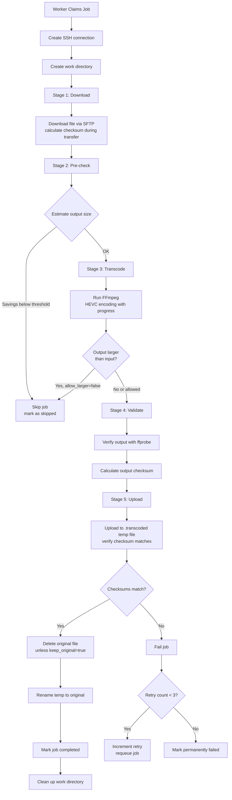

# Transcoder Architecture

## Overview

A TUI-based media transcoder that scans remote libraries via SSH/SFTP, queues files for transcoding, and manages the entire workflow with integrity verification.

## Components

```
┌─────────────────────────────────────────────────────────┐
│                    TUI (Bubble Tea)                     │
│  Dashboard │ Jobs │ Settings │ Scanner │ Logs          │
└─────────────────────┬───────────────────────────────────┘
                      │
┌─────────────────────┼───────────────────────────────────┐
│                     │                                   │
│  ┌─────────┐   ┌────▼────┐   ┌──────────┐              │
│  │ Scanner │   │ Worker  │   │ Encoder  │              │
│  │         │   │  Pool   │   │ (FFmpeg) │              │
│  └────┬────┘   └────┬────┘   └────┬─────┘              │
│       │             │              │                    │
│       └─────────────┼──────────────┘                    │
│                     │                                   │
│              ┌──────▼──────┐                            │
│              │   Database  │                            │
│              │  (SQLite)   │                            │
│              └─────────────┘                            │
└─────────────────────────────────────────────────────────┘
```

## Package Structure

```
transcoder-go/
├── cmd/transcoder/       # Main entry point
├── internal/
│   ├── config/           # YAML configuration
│   ├── database/         # SQLite schema & queries
│   ├── scanner/          # Remote library scanning (SSH/SFTP)
│   ├── transcode/        # Worker pool & FFmpeg encoding
│   ├── checksum/         # xxHash64/MD5 utilities
│   ├── tui/              # Bubble Tea TUI
│   └── types/            # Shared data types
└── docs/                 # Documentation
```

---

## Startup Workflow

### Startup Sequence


### Scenarios

#### 1. Fresh Start (No Database)
- Creates new SQLite database at configured path
- Runs initial schema creation
- No files in `media_files` table
- No jobs to process
- **User action needed**: Press `s` to scan remote library

#### 2. Existing Database, No Active Jobs
- Opens existing database
- Runs migrations if schema version is outdated
- Workers start but find no queued jobs
- Workers poll every 2 seconds for new jobs
- **User action needed**: Press `a` to queue jobs for transcoding

#### 3. Existing Database with Queued Jobs
- Workers immediately start claiming queued jobs
- Jobs processed in priority order (highest first)
- Multiple workers can process different jobs concurrently

#### 4. Recovery After Crash (Orphaned Jobs)
Jobs in active states (`downloading`, `transcoding`, `uploading`) without a worker are recovered:

| Previous Status | Recovery Action |
|----------------|-----------------|
| `downloading` | Reset progress to 0, will re-download |
| `transcoding` | Keep progress, may resume from existing files |
| `uploading` | Keep progress, may resume from transcoded file |

### Worker Job Processing

When a worker claims a job, it checks for existing work:


### Work Directory Structure

Default: `~/transcoder_temp/` (configurable via `workers.work_dir`)

```
~/transcoder_temp/
├── job-123/
│   ├── Movie.Name.2024.mkv           # Downloaded input
│   └── transcoded_Movie.Name.2024.mkv # Transcoded output
├── job-124/
│   └── ...
```

Files in work directories persist across restarts, enabling job resume.

### Database States on Startup

| Table | Fresh Start | After Scan | After Queue | After Transcode |
|-------|-------------|------------|-------------|-----------------|
| `media_files` | Empty | Populated with metadata | Unchanged | `should_transcode=0` for completed |
| `transcode_jobs` | Empty | Empty | Jobs with `status=queued` | Jobs with `status=completed` |
| `system_state` | `schema_version=2` | `last_scan_time` updated | Unchanged | Unchanged |

---

## Scanning Flow

### Parallel Scanner Architecture

The scanner uses a **producer-consumer pattern** with parallel FFprobe execution and SSH connection pooling for optimal performance:

```
┌─────────────────────────────────────────────────────────────┐
│                   SCANNER ARCHITECTURE                       │
│                                                              │
│  ┌──────────────┐                                           │
│  │  Directory   │                                           │
│  │   Walker     │ (Main Thread - Serial)                    │
│  │  (Producer)  │                                           │
│  └──────┬───────┘                                           │
│         │                                                    │
│         │ Enqueues work items                               │
│         ▼                                                    │
│  ┌──────────────────┐                                       │
│  │   Work Queue     │ (Buffered Channel)                    │
│  │  workItem Chan   │                                       │
│  └────────┬─────────┘                                       │
│           │                                                  │
│           │ Distributed to workers                          │
│           ▼                                                  │
│  ┌────────────────────────────────────┐                     │
│  │     Worker Pool (4 goroutines)    │                     │
│  │                                    │                     │
│  │  ┌──────┐  ┌──────┐  ┌──────┐    │                     │
│  │  │Worker│  │Worker│  │Worker│ ...│                     │
│  │  │  1   │  │  2   │  │  3   │    │                     │
│  │  └──┬───┘  └──┬───┘  └──┬───┘    │                     │
│  │     │         │         │         │                     │
│  └─────┼─────────┼─────────┼─────────┘                     │
│        │         │         │                                │
│        │  Get SSH from pool                                │
│        │         │         │                                │
│        ▼         ▼         ▼                                │
│  ┌──────────────────────────────────┐                      │
│  │      SSH Connection Pool         │                      │
│  │   (4 reusable connections)       │                      │
│  └────────┬─────────────────────────┘                      │
│           │                                                 │
│           │ Execute FFprobe                                │
│           ▼                                                 │
│  ┌──────────────────┐                                      │
│  │  Results Queue   │ (Buffered Channel)                   │
│  │ workResult Chan  │                                      │
│  └────────┬─────────┘                                      │
│           │                                                 │
│           ▼                                                 │
│  ┌──────────────────┐                                      │
│  │     Results      │ (Single Goroutine)                   │
│  │    Processor     │                                      │
│  │   (Consumer)     │                                      │
│  └────────┬─────────┘                                      │
│           │                                                 │
│           │ Batches DB operations                          │
│           ▼                                                 │
│  ┌──────────────────┐                                      │
│  │    Database      │                                      │
│  │  (Batch Writes)  │                                      │
│  └──────────────────┘                                      │
└─────────────────────────────────────────────────────────────┘
```

### Scanning Process


### Key Optimizations

1. **SSH Connection Pool**
   - Pool of reusable SSH connections (configurable via `remote.ssh_pool_size`, 1-16, default 4)
   - Eliminates ~200ms overhead per file from spawning SSH processes
   - Workers get/put connections for FFprobe execution

2. **Parallel FFprobe Execution**
   - 4+ files processed simultaneously
   - 5-10x speedup vs serial execution

3. **Batch Database Operations**
   - Results processor batches inserts/updates (20 files per transaction)
   - 80-90% reduction in transaction overhead

4. **Progress Throttling**
   - Updates sent every 2 seconds OR every 10 files
   - Reduces callback overhead by ~99%

5. **Prepared SQL Statements**
   - `GetMediaFileByPath` uses prepared statement (called once per file)
   - Eliminates SQL parsing overhead

6. **Buffered Logging**
   - Uses `bufio.Writer` with periodic flushing
   - Reduces I/O syscalls

7. **Background Checksums**
   - First scan skips checksums (deferred to `BackfillChecksums`)
   - Subsequent scans only checksum changed files

---

## Transcoding Flow



---

## Database Schema

### media_files
Discovered video files from remote library.

| Column | Type | Description |
|--------|------|-------------|
| id | INTEGER | Primary key |
| file_path | TEXT | Full remote path |
| file_name | TEXT | Filename only |
| file_size_bytes | INTEGER | File size |
| codec | TEXT | Video codec (h264, hevc, etc.) |
| resolution_width | INTEGER | Width in pixels |
| resolution_height | INTEGER | Height in pixels |
| duration_seconds | REAL | Video duration |
| bitrate_kbps | INTEGER | Bitrate |
| fps | REAL | Frames per second |
| should_transcode | BOOLEAN | Needs transcoding? |
| transcoding_priority | INTEGER | Queue priority |
| source_checksum | TEXT | xxHash64 or MD5 |
| source_checksum_algo | TEXT | Algorithm used |
| source_checksum_at | TIMESTAMP | When calculated |

### transcode_jobs
Active and completed transcoding jobs.

| Column | Type | Description |
|--------|------|-------------|
| id | INTEGER | Primary key |
| media_file_id | INTEGER | FK to media_files |
| status | TEXT | queued/downloading/transcoding/uploading/completed/failed/paused/canceled/skipped |
| stage | TEXT | download/transcode/validate/upload |
| progress | REAL | 0-100 percentage |
| worker_id | TEXT | Assigned worker |
| transcoded_file_size_bytes | INTEGER | Output size |
| encoding_time_seconds | INTEGER | Total encode time |
| encoding_fps | REAL | Encoding speed |
| local_input_checksum | TEXT | Downloaded file checksum |
| local_output_checksum | TEXT | Transcoded file checksum |
| uploaded_checksum | TEXT | Uploaded file checksum |
| checksum_verified | BOOLEAN | All checksums match |
| error_message | TEXT | Last error |
| retry_count | INTEGER | Number of retries |
| priority | INTEGER | Job priority |

### processing_log
Event log for debugging.

### system_state
Key-value store for app state (last scan time, schema version, etc.)

---

## Configuration

```yaml
remote:
  host: "media-server"
  port: 22
  user: "user"
  ssh_key: "~/.ssh/id_rsa"
  media_paths:
    - "/path/to/media"
  ssh_pool_size: 4          # SSH connections for scanning (1-16)
  ssh_timeout: 30           # Connection timeout in seconds
  ssh_keepalive: 0          # Keepalive interval (0 = disabled)
  sftp_buffer_size: 32768   # SFTP buffer size in bytes (up to 1MB)

database:
  path: "~/transcoder/transcoder.db"

workers:
  max_workers: 2
  work_dir: "~/transcoder_temp"
  skip_checksum: false      # Skip verification for speed

encoder:
  codec: "hevc_videotoolbox"
  quality: 75               # 0-100, higher is better
  preset: "medium"          # ultrafast to veryslow
  min_expected_savings: 10  # Skip if less than 10% savings expected
  allow_larger: false       # Skip if output would be larger

files:
  extensions:               # File types to process
    - mkv
    - mp4
    - avi
  min_size: 0               # Minimum file size in bytes
  exclude_patterns: []      # Glob patterns to exclude
  follow_symlinks: false
  keep_original: false      # Keep source after transcoding

scanner:
  auto_scan_hours: 0        # Periodic scan interval (0 = disabled)
  auto_queue: false         # Auto-queue jobs after scan

logging:
  level: "info"             # debug, info, warn, error
  file: "~/transcoder/transcoder.log"
  scanner_log: "~/transcoder/scanner.log"
  max_size: 104857600       # Log rotation size (100MB)
```

---

## Logging

### Log Files

| Log File | Purpose |
|----------|---------|
| `transcoder.log` | Application events: job claims, completions, failures, worker scaling |
| `scanner.log` | Scanner debug output: SSH connection, ffprobe results, file discovery |

### Log Levels

- **debug**: Verbose output for development
- **info**: Job lifecycle events, startup/shutdown
- **warn**: Recoverable errors, configuration issues
- **error**: Job failures, connection errors

### What Gets Logged

**Application Log (`transcoder.log`):**
- Startup and shutdown
- Database operations
- Worker pool scaling
- Job claims: `[worker-0] Claimed job 123: Movie.mkv`
- Job completions with stats: `[worker-0] Job 123 completed: Movie.mkv (45.2% size reduction, 1234s encode time)`
- Job failures with errors

**Scanner Log (`scanner.log`):**
- SSH connection details
- Directory traversal
- ffprobe command results
- Checksum calculations
- File additions/updates

---

## Key Design Decisions

### Checksum Strategy
- **First scan**: Skip checksums for speed (ffprobe only)
- **Subsequent scans**: Backfill checksums for unchanged files
- **Size comparison**: Fast change detection without reading entire file
- **Transfer verification**: Checksums calculated during download/upload

### Job Recovery & Resume
- Jobs survive application restart
- Orphaned jobs (downloading/transcoding/uploading) are recovered
- Workers re-claim orphaned jobs with priority
- **Stage skipping**: Jobs resume from where they left off:
  - Skip download if file already exists locally
  - Skip transcode if valid output file exists
  - Validates existing files before skipping

### Atomic File Replacement
1. Upload to `filename.transcoded` (temp)
2. Verify upload checksum matches local output
3. Delete original
4. Rename temp to original

### Worker Pool
- Configurable number of concurrent workers (0 to N)
- Each worker has dedicated SSH connection
- Progress updates via channel to TUI
- Pause/cancel support per job
- **Graceful scaling**: Workers complete current job before stopping when scaled down
- **Wind-down mode**: Set workers to 0 before shutdown/maintenance - active jobs complete, no new jobs claimed

### Progress Tracking
- **Download/Upload**: Byte-based progress (bytes transferred / total bytes)
- **Transcoding**: Time-based progress using `out_time_us` from ffmpeg (more reliable than frame count)

### Automatic Scanning
- Periodic scans at configurable intervals (`scanner.auto_scan_hours`)
- Optional auto-queue after scan completes (`scanner.auto_queue`)
- Runs in background without blocking TUI

### Retry Logic
- Failed jobs automatically retry up to 3 times
- Retry count tracked in database
- After 3 failures, job marked as permanently failed
- Prevents infinite retry loops on persistent errors

### Early Size Detection
- Pre-transcode estimation predicts output size
- Jobs skipped if estimated savings below `encoder.min_expected_savings` threshold
- Post-transcode check skips upload if output larger than input (unless `encoder.allow_larger`)
- Skipped jobs marked with `skipped` status

### Job Search & Filtering
- Full-text search across all jobs by filename
- Filter by content type (Movies/TV based on path)
- Bulk actions (pause/cancel) from search results
- No limit on displayed queue items

### Log Rotation
- Configurable max log size (`logging.max_size`)
- Automatic rotation when size exceeded
- Prevents unbounded log growth

---

## Performance Optimizations

### Scanner Optimizations (5-10x speedup)

1. **Parallel FFprobe Execution**
   - Worker pool pattern with concurrent goroutines
   - Files processed in parallel vs serial execution
   - Configurable via `remote.ssh_pool_size` (1-16, default 4)

2. **SSH Connection Pooling**
   - Pool of reusable SSH connections (configurable pool size)
   - Eliminates ~200ms overhead per file from spawning SSH processes
   - Workers get/put connections for parallel operations
   - Configurable timeout and keepalive settings

3. **Batch Database Operations**
   - Results processor batches inserts/updates (20 files per transaction)
   - Single transaction for multiple files
   - 80-90% reduction in database overhead

4. **Prepared SQL Statements**
   - `GetMediaFileByPath` uses prepared statement
   - Called once per file during scan
   - Eliminates SQL parsing overhead on repeated queries

5. **Progress Update Throttling**
   - Updates sent every 2 seconds OR every 10 files (whichever comes first)
   - Reduces callback overhead by ~99%
   - Thread-safe progress tracking with mutex

6. **Buffered Logging**
   - Uses `bufio.Writer` with periodic flushing
   - Reduces I/O syscalls during high-frequency logging
   - Flushes with progress updates and on scan completion

7. **Pre-scan File Counting**
   - Lightweight directory walk to count total files
   - Enables accurate progress percentage display
   - Extension-based filtering (no FFprobe needed)

8. **Skip FFprobe for unchanged files**
   - DB lookup before expensive remote call
   - Size comparison as fast-path check

9. **Background Checksum Calculation**
   - First scan skips checksums entirely (deferred to `BackfillChecksums`)
   - Checksums fill in during subsequent scans or background tasks
   - Main scan focuses on metadata extraction only

### Transcoding Optimizations

1. **Size-based change detection** - No need to read file contents
2. **Streaming checksum calculation** - Zero overhead during transfers (skippable via `workers.skip_checksum`)
3. **No redundant verification** - Upload checksum verified during transfer, no re-read after
4. **Stage skipping** - Resume from where jobs left off (skip completed stages)
5. **Pre-transcode estimation** - Skip jobs unlikely to achieve minimum savings threshold
6. **Early termination** - Stop transcoding if output exceeds input size (configurable)
7. **SFTP buffer optimization** - Tunable buffer sizes up to 1MB (`remote.sftp_buffer_size`)
